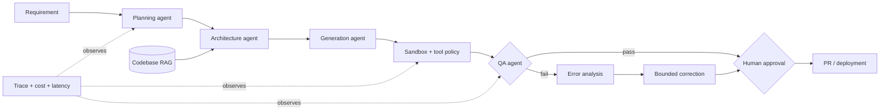

# Forge — Agentic Software Engineering / Product Builder

Forge is a compact, production-shaped reference implementation of an autonomous software-delivery loop. It turns a product requirement into planning and architecture artifacts, retrieves codebase context, executes quality gates in a constrained workspace, analyzes failures, prepares bounded correction, and stops at a human-gated release candidate.

> [!IMPORTANT]
> **Project status: alpha reference implementation.** Forge is publishable for
> learning, portfolio use, and trusted local experiments. It is not yet a hosted
> product or a safe boundary for executing untrusted generated code. See
> [Production readiness](#production-readiness) and [SECURITY.md](SECURITY.md).

```text
User requirement
  → Planning → Architecture + code RAG → Generation
  → Guardrailed sandbox → QA → Error analysis → Self-correction
  → Human approval → Pull request / deployment
```

Unlike a chatbot demo, the project focuses on the difficult systems concerns around coding agents: deterministic orchestration, tool security, auditability, measurable outcomes, and controlled autonomy.

## Capabilities

| Concern | Implementation |
| --- | --- |
| Multi-stage workflow | Typed agents and artifacts coordinated by an explicit state machine |
| Codebase RAG | Dependency-free lexical retrieval with exclusions, size limits, scores, and excerpts |
| Tool calling | A fixed-workspace terminal adapter designed to be extended with GitHub/filesystem tools |
| Guardrails | Deny patterns for destructive commands and approval policies for push/deploy operations |
| Correction workflow | Failed gates route through diagnosis and a bounded correction proposal; applying model-generated patches is future work |
| Evaluation | Composite completion, test-success, and deployment-safety score |
| Observability | Per-stage JSONL traces with status, latency, errors, token usage, and cost fields |
| Human control | Release output is always a proposal and explicitly requires approval |

## Quick start

Forge has no runtime dependencies beyond Python 3.11+.

```bash
python -m venv .venv
. .venv/bin/activate
pip install -e .
forge "Add rate limiting to the public API" --title "API rate limiting" --test-command "python3 -m unittest"
```

The command prints the complete run as JSON and writes machine-readable traces to `.forge/traces.jsonl`. A successful run ends with `open_pull_request`, but does not perform that operation: a person or policy engine must approve the boundary.

## Architecture



The default generation stage is intentionally **proposal-only**. This makes the safe execution contract clear while leaving a clean provider seam for an LLM-backed structured patch generator. The runner avoids a shell, uses an executable allowlist, strips the ambient environment, fixes the working directory, applies a timeout, captures output, and checks commands against policy. It is still a subprocess runner—not a security sandbox. For untrusted code, replace it with an ephemeral container or microVM implementation without changing agents.

## Production readiness

| Usage | Status | Why |
| --- | --- | --- |
| Portfolio / architecture demonstration | Ready | Runnable workflow, tests, CI, documentation, traces, and explicit trade-offs |
| Trusted local repository experiments | Alpha | Structured plans and external model gateways can be approved and applied |
| Team pilot | Not yet | Needs a production provider adapter, identity/RBAC, GitHub integration, and container isolation |
| Untrusted code or production deployment | Not safe | Requires a hardened remote execution plane, secrets broker, audit retention, and deployment approval service |

Before calling Forge a complete end-user product, implement the seven items below and conduct threat modeling, load testing, model evaluation, accessibility review, and an external security assessment.

## Extending toward production

1. Implement a first-party hosted-model `CodeProvider` with authentication, retries, usage accounting, and redaction.
2. Add GitHub and deployment adapters behind the same policy boundary; use short-lived, least-privilege credentials.
3. Replace lexical retrieval with hybrid symbol + embedding retrieval and enforce context/token budgets.
4. Run generated changes in disposable containers with network disabled by default.
5. Replace local JSON checkpoints with a transactional workflow store for distributed workers.
6. Export traces to OpenTelemetry and build dashboards for pass rate, correction rate, cost, latency, and policy violations.
7. Evaluate on a pinned task suite using compile success, tests, mutation score, static analysis, diff size, security findings, and human-review acceptance.

## Applying a structured change plan

Providers return complete-file operations instead of arbitrary shell commands. A
plan is reviewed first; no edit occurs without the separate approval flag.

```json
{
  "summary": "Add the health endpoint",
  "edits": [
    {
      "path": "src/app/health.py",
      "action": "create",
      "content": "def health():\n    return {'status': 'ok'}\n"
    }
  ]
}
```

```bash
# Validate, checkpoint, and stop at the approval boundary.
forge "Add a health endpoint" --plan change-plan.json

# Apply atomically per file, run QA, and prepare the release candidate.
forge "Add a health endpoint" --plan change-plan.json --approve-edits

# A stopped run can also be approved and resumed by its printed run_id.
forge "Add a health endpoint" --plan change-plan.json --approve-edits --resume RUN_ID
```

Create operations fail if a target already exists. Updates and deletes fail if a
target is absent. Providers must include `expected_sha256` on updates/deletes
to prevent overwriting a file that changed after context retrieval. Absolute,
parent-traversing, duplicate, oversized, and symlinked paths are rejected. Every
stage is atomically checkpointed under `.forge/runs/`.

## Connecting a model gateway

`CommandCodeProvider` makes Forge model-agnostic while keeping an auditable data
boundary. The configured command receives one JSON request on standard input and
must return one `ChangeSet` JSON object on standard output. The request includes
the task, acceptance criteria, retrieved architecture context, prior artifacts,
workspace path, and required response schema.

```bash
forge "Implement the checkout validation" \
  --provider-command "python3 integrations/my_model_gateway.py" \
  --provider-env MODEL_API_KEY
```

This first invocation checkpoints the proposed edits and exits before mutation.
After reviewing the checkpoint, rerun with `--approve-edits`, or approve the
existing run using `--resume RUN_ID --approve-edits`.

Provider commands run without a shell, have a configurable timeout, receive a
minimal environment, and only inherit variables named by repeatable
`--provider-env` flags. Provider executables are trusted integrations: they are
not run inside the local command allowlist or an OS-level sandbox. Never point
this option at untrusted repository content; production gateways should run as a
separately isolated service.

## Evaluation philosophy

Do not evaluate coding agents only on whether they produce syntactically valid code. A credible scorecard combines:

- **Correctness:** hidden tests, regression tests, and requirement coverage.
- **Maintainability:** lint/type checks, complexity, duplication, and reviewer acceptance.
- **Safety:** prohibited action rate, secret leakage, dependency risk, and approval bypass attempts.
- **Efficiency:** end-to-end latency, tokens, cost, tool calls, and correction iterations.
- **Operational quality:** trace completeness, reproducibility, and recovery after failures.

Run the included checks with:

```bash
PYTHONPATH=src python3 -m unittest discover -s tests -v
```

## Portfolio framing

**Problem:** coding assistants can generate patches, but reliable product delivery requires context retrieval, controlled execution, verification, recovery, auditability, and accountable deployment.

**Design choice:** Forge separates reasoning stages from tools, treats every stage output as data, puts policy before side effects, and makes human approval a workflow state rather than a disclaimer.

**Interview discussion:** useful trade-offs include deterministic workflows versus open-ended agents, lexical versus embedding retrieval, subprocess versus container isolation, retry budgets, approval UX, evaluation leakage, and cost/quality optimization.
